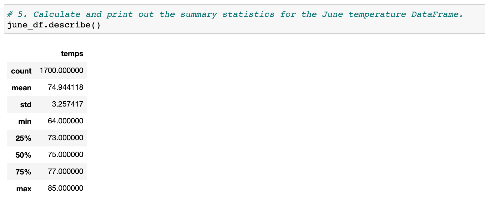
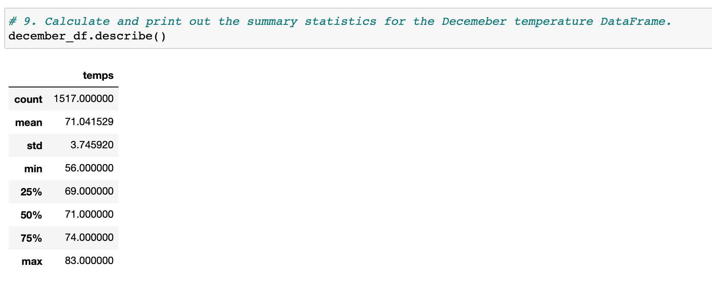

# Surf's Up with Advanced Data Storage and Retrieval 

## Background and Purpose

The purpose of this challenge is to give W. Avy further analysis due to the fact that he will be opening a surf and ice cream shop and would like to know more about temperature trends prior to opening. Specifically he wants the temperature data for the months of June and December in Oahu. So we started off by pulling data from an SQLite data base and created summary statistics comparing the month of June to the month of December. The purpose behind these summary statistics is to determine whether or not the surf and ice cream shop will be sustainable year around. These statistics will help provid Mr.AVy with accurate information that will allow him to make important business decisions therefore I must be accurate when analyzing and calculating this information.

## Analysis and Results

Using Python, Pandas functions and methods, and SQLAlchemy, I had to filter the date column of the Measurements table in the hawaii.sqlite database to retrieve all the temperatures for the month of June and December. From there I then converted those temperatures to a list, created two DataFrame's from each list, and generated the summary statistics for each month. This process was done by creating a query that filters the date column from the measurment table to obtain all the temperatures for the months of June and December.

### Summary statistics for the month of June.

 

* #### Average Temperature = 75 Degrees

### Summary statistics for the month of December.

 

* #### Average Temperature = 71 Degrees

## Summary and Conclusion

Before even looking at the numbers, everyone knows that Hawaii is known for its tropical weather and is a prime vacation destination. So ideally opening a buisness in an area like this could be very lucrative but we must look deeper look into the numbers in order to understand if a Surf and Ice Cream buisness would run well year around. Key word being year around because while a buisness like this is almost guaranteed to do well during the summer, its not as easy to say for the winter time. Taking a look at both summary statistics we can see that there is a obvious difference in temperature for the two months which could have been determined without any coding. What we really want to look at is how significant of a difference is it and would it have a major effect on a surf and ice cream shop. So taking a depper dive into the numbers we can see that the average temperature only decreases 4 degrees from the summer to the winter (75 to 71 degrees) which is a great sign. Also it is clear that max temperatures to not differ significantly, with only a slight decrease of two degrees from June to December (85 to 83 degrees). Knowing all of this information we can conclude that based on temperature trends, the likelihood of the Surf and Ice Cream shop doing well year around should not be affected by the temperature. This does not guarantee that the buisness will be succesful year around though, there are many other factor that go into whether or not a buisness will be succesful year aorund such as tourism, world events, and marketing. What we can say based on this analysis is that the temperature trends clearly show that if Surf and Ice Cream was to open up, the buisness should not be to worried about change in temperature from June to December.
